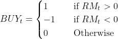

# Bitcoin trading strategy based on Investors Sentiment

## Project Description

#### Objective
Study whether several measures of investor sentiment in the Bitcoin market
could predict the returns of this market. Also compare the performance of different Machine learning
models (for now : two of which are Random Forest) in predicting cryptocurrency returns.

#### Status
##### Completed
1. Dataset collected from various source to get the sentiment data
2. Processed the  textual data using Sentiment analysis method : [Chen et al](https://papers.ssrn.com/sol3/papers.cfm?abstract_id=3398423)
3. Random decison tree methods are used to predict market return based on sentiment data.
4. A simple buy and sell trading startegy developed : Refer trading strategy section.
##### To do/Dev
1. To do : try complex algorithms like XGBoost, RNN etc. 
2. a complex trading startegy, refer trading startegy section.

##### Acknowledgement
Note: The idea for this project is from [dang-trung](https://github.com/dang-trung/crypto-sentiment-index) and some of his code has been used for 
the development. You can find proper acknowledgment in the code scripts. And please refer the readme files in the 
consecutive folders/packages to understand how to run the codes.

Want to know more about how sentiment t can be used as a tool to predict  crypto-
currency return read his full thesis available here : 

#### Dependencies
- Python 3
- numpy==1.18.5
- pandas==1.0.5
- scikit-learn==0.23.2
- pytrends==4.7.3
- statsmodels==0.12.0
- plotly==4.9.0
- nltk==3.5
- beautifulsoup4==4.9.3

#### About the dataset.

Please refer the readme file in repo-root/data/README.md
The original dataset stored in repo_root/data/02_processed/final_dataset.csv files contains the following entries.

1. Data Collection : 

Please check repo_root/src/data/README.md

2. Data processing : 
Please check repo_root/src/process/README.md

#### Getting started

##### How to RUN?

($ indicates these are terminal commands)
1. Clone this repo `$ https://github.com/zackdilan/bitcoin-sentiment-index.git`

2. Create your venv:  
    `$ cd bitcoin-sentiment-index`  
    `$ virtualenv -p python3 venv`  
    `$ source venv/bin/activate(bash)`  
    `$ (venv) pip install -r requirements.txt`
    
3. In terminal  
- Get the data : `$ python -m src.data`  
- Process data : `$ python -m src.process`

#### ML approaches and Trading strategy
##### Case Study : 1

1. Machine learning case study over Market returns(RM) as the dependant variables 
and sentiment data as the independent variables.
2. Our goal is to predict the MArket return based on the past 5 days sentiments.
3. Initially a Random forest regressor and a classifier is trained to predict the market returns.
4. We have used the 70% - 30% for training and validation.
5. Since its a Time series analysis, we have used the past data for training and later data
for validation.

6. Then a trading strategy is developed: 

      

#####Results
* Random Forest Regressor    

    * Accuracy : 61.39%
    * Confusion  Matrix
    
    
|   |   |Actual   |   |   |
|---|---|---|---|---|
|   |   |Negative   | Unchanged  |  Positive |
| Negative  |   | 165  |  - | 105  |
|  Unchanged |   |  - |  - |   -|
| Positive  |   | 117  | -  | 192  |    

* Random Forest Classifier    

    * Accuracy : 60.87%
    * Confusion  Matrix
    
    
|   |   |Actual   |   |   |
|---|---|---|---|---|
|   |   |Negative   | Unchanged  |  Positive |
| Negative  |   |  171 |  - |   95|
|  Unchanged |   | -  |   -|  - |
| Positive  |   |  130 | -  | 179  |

A sample trading signal performance on Bitcoin Price is shown below    

  
  
##### Conclusion

So far we have seen how to gather sentiment data and use it to create a short term trading signals
for Bitcoin price or returns. But we need to work further on
1. The Accuracy of the ML models
2. Update the trading strategy in a way the user gain a profit margin for eg. After a buy signal, we have to provide a SELL
signal only before a major breakthrough in the price. More details will be added soon.

